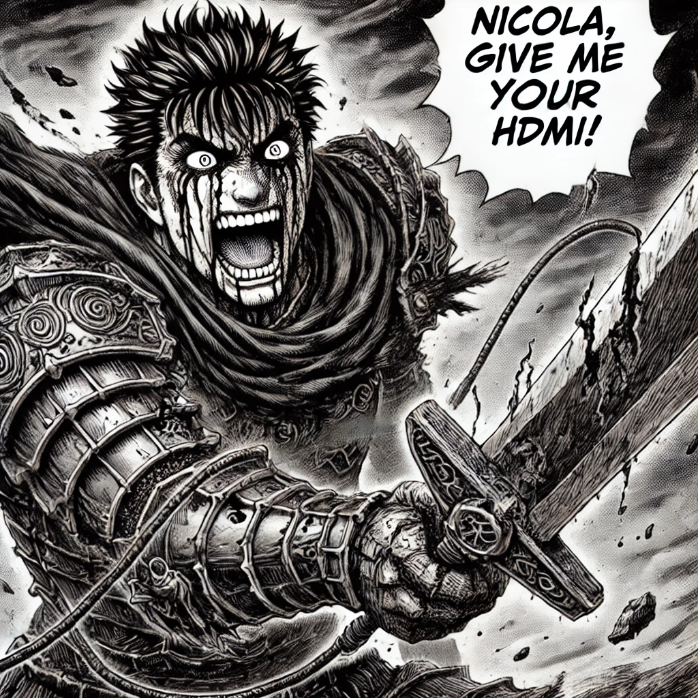

# ponderadas-m11

## Ponderada 1 - CPU de 8 bits

Construção de uma ALU utilizando o software Digital.

## Ponderada 2 - Visão computacional com hardware embarcado

Detecção de pessoas utilizando o ESP32-CAM e o TensorFlow Lite.

Links utilizados para a realização da ponderada 2:
    - https://www.instructables.com/ESP32-CAM-Person-Detection-Expreiment-With-TensorF/

Vídeo de demonstração: https://youtu.be/t2okPBMkaIk